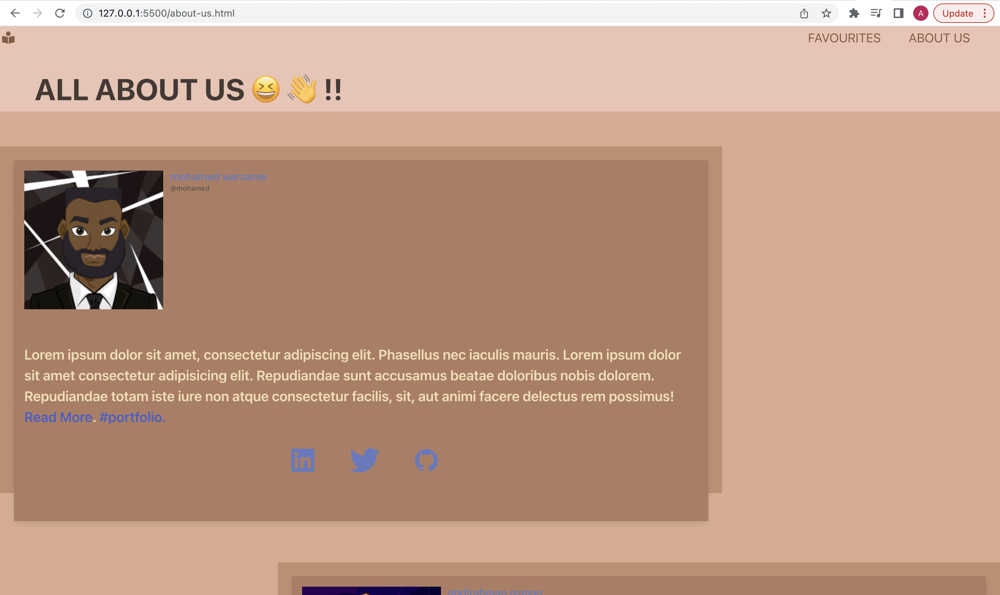

# Project-Title

Library Of Knowledge 📖

# About This Project

The idea behind this project was being able to create a modern library for its users. Users will be able to seek knowledge regarding any topic through searching for it in the own personal library the user will also be to save this book and delete it from there selection once read. Also users will be able to find inspiration and knowledge through a informative quote being rendered which they will be able to save to there quotes library.

# Deployed Link For This Project

[here](https://aosman0.github.io/library-of-knowledge/)

# The User Journey

On arrival of the home page the user will be presented with an quote which will inspire and motivate the user in seeking knowledge.
The user will able to save this quote to save in there own personal space where they can view the quote again.
The user will also on the landing page be able to search for the author and book which they are interested in reading .
The user will be presented with book cards that describe the book. The user will then be able to click read more to view a copy of the book so they can read that book.
The user will also be able to save there favourite books for late read and to establish there own library.
Upon completion of there favourite book the user will be able to delete it from there favourites list.

## Screenshots

Below are screenshots of desktop viewport.

## Responsive

Below are screenrecordings and screenshots of the site being responsive

Below is the screen recording demonstrating a responsive layout.

https://drive.google.com/drive/folders/1-XhHneRNkt_59kFvZIVcfdn2J9cbtLEP?usp=sharing

# Skills Gained 👨‍💻

.Communication

.Team Work

.Time Management

.Problem Solving Skills

# Contributors

.[abdilatif-warsame]-(https://github.com/awarsame1996)

.[abdinasir-warsame]-(https://github.com/abdinasir1993)

.[mohamed-warsame]-(https://github.com/MohamedWarsame04)

.[abdirahman-osman]-(https://github.com/AOsman0)

# Technology Used

.JavaScript

.jQuery

.HTML

.CSS

.BootStrap and other Frameworks

.VS Code

.GitHub

.Terminal
